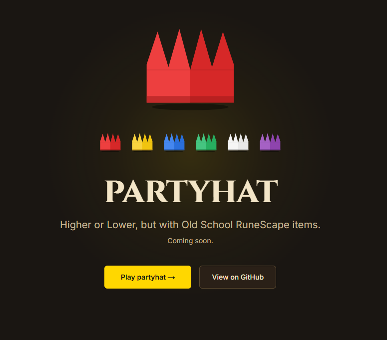

# 🎩 partyhat

> Higher or Lower, but with Old School RuneScape items.

[Live demo](https://partyhat-orpin.vercel.app/play) · [Built by Alexander Melander](https://alexmelander.vercel.app) · [LinkedIn](https://www.linkedin.com/in/alexander-melander-0b804726a/)



## About

Old School RuneScape has roughly 12,000 unique items, each with a live Grand Exchange price that fluctuates every day. I wanted to know: how well do players actually know what their stuff is worth?

`partyhat` is a Higher or Lower game built on top of the real OSRS Grand Exchange. You're shown two items — you guess which one trades for more gp. The catch: the data is live, pulled from the official OSRS Wiki Prices API.

I'm building this in public as I look for my next frontend or full-stack role. It's a learning project as much as a portfolio one — I'm using it to deepen my Next.js App Router, backend, and database skills.

## Project status

**Phase 1 (complete):** Playable Higher/Lower game with local persistence, animations, and accessibility support.

**Phase 2 (next):** Replace static dataset with live OSRS Wiki API data. Postgres-backed persistence. Background jobs to refresh prices on a schedule.

**Phase 3:** Global leaderboard.

**Phase 4:** Accounts, multi-device sync.

## Phase 1 milestones (shipped)

- [x] Foundation: design system, fonts, animated landing page
- [x] Item data and types
- [x] Game core loop
- [x] Game UI polish (count-up, transitions, verdict feedback)
- [x] Local image hosting
- [x] Persistence and timer
- [x] Reduced-motion respect

Live game: https://partyhat-orpin.vercel.app/play

## Tech

- **Next.js 16** (App Router, Server Components, Turbopack)
- **TypeScript** (strict mode, `noUncheckedIndexedAccess`)
- **Tailwind CSS 4** with custom design tokens
- **Framer Motion** for animations
- **next-themes** for theme infrastructure
- **Postgres + Drizzle ORM** (coming in Phase 2)
- Deployed on **Vercel**

## Data

Item and price data comes from the [OSRS Wiki Real-time Prices API](https://oldschool.runescape.wiki/w/RuneScape:Real-time_Prices), used in accordance with their acceptable use policy. Once the backend lands, prices will be cached and refreshed on a schedule rather than fetched per-request, to be polite to the API.

Not affiliated with Jagex Ltd.

## Run it locally

```bash
git clone git@github.com:melander97/partyhat.git
cd partyhat
npm install
cp .env.example .env.local
npm run dev
```

Open [http://localhost:3000](http://localhost:3000).

## Scripts

```bash
npm run dev          # start dev server (Turbopack)
npm run build        # production build
npm run start        # run the production build locally
npm run lint         # ESLint
npm run format       # Prettier write
npm run format:check # Prettier check (no writes)
```

## Notable design decisions

A few choices I made and the reasoning, since this is partly a learning project and the _why_ matters more than the _what_:

- **Next.js full-stack over a separate Node backend.** Faster to ship and forces me to learn App Router + Server Components deeply, which is the modern Next.js skill gap. I'd revisit this if the API ever needed to serve multiple frontends.
- **Drizzle over Prisma** (coming Phase 2). Drizzle is closer to SQL and teaches more about what's actually happening at the database layer. Prisma hides more.
- **Hand-written SVG for the partyhat** instead of an asset. Forces understanding of SVG paths, scales perfectly, and themes via CSS variables.
- **Design tokens in CSS, not JS.** Using Tailwind 4's `@theme` block means colors live in one place and the entire site re-themes by changing a variable. Phase 1 will add a light theme to prove the system works.
- **No Husky / commitlint.** I write Conventional Commits by habit; enforcing it via tooling would have been theater on a solo project. Will revisit if the project ever gets a collaborator.

## License

MIT. Use whatever you want.
